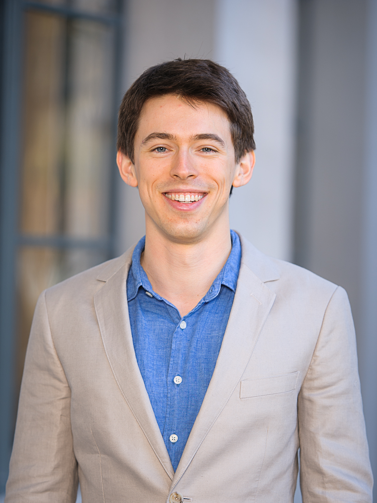

### Post-Doctoral Scholar

 

<!-- UNDER CONSTRUCTION -->

<!-- 
 -->

I am a post-doctoral scholar in the [Department of Agricultural and Resource Economics at UC Davis](https://are.ucdavis.edu), where I apply dynamic models from resource economics to agricultural production and policy issues. I also study the impacts of agroenvironmental policy in California. 

I received my Ph.D. in Agricultural and Resource Economics in 2017 from the [University of California at Berkeley](https://are.berkeley.edu), and received my undergraduate degree in Resource Economics (First Class Honours and University Medal) from the [University of Sydney, Australia](http://sydney.edu.au).

My primary fields of study are agricultural, environmental, and natural resource economics. 

  
